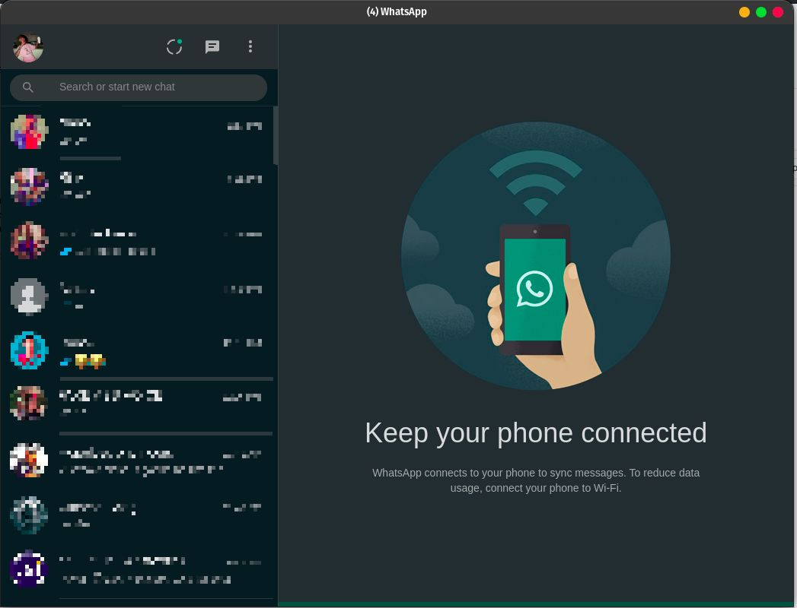

# WhatsAppWebapp
**whatsapp web app for linux**

wrapped up the web app in a native linux app
## Screenshot


## Installation
#### start a terminal
```
wget https://github.com/drunckj/whatsappwebapp/releases/download/v1.1/whatsappweb-1.1.tar.xz
tar -xf whatsappweb-1.1.tar.xz
cd whatsappweb-1.1/
chmod +x install.sh
sudo ./install.sh
```
**if it doesnt showw up in applications restart your environment**
## Uninstall
**go into the extracted folder**
```
chmod +x uninstall.sh
sudo ./uninstall,sh
```


#### Want to buy me a coffee: https://www.paypal.me/drunkcj
